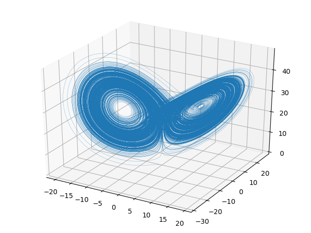
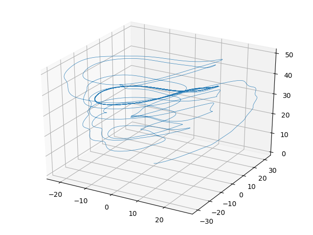

```python
import MATLAB  # pyMATLABstyle
import math


class Particle(object):
    def __init__(self, xyz=(0, 0, 0), dxyz=(0, 0, 0), step_size=0.001):
        self.x, self.y, self.z = xyz
        self.dx, self.dy, self.dz = dxyz
        self.step_size = step_size

    def move(self):
        self.x += self.dx * self.step_size
        self.y += self.dy * self.step_size
        self.z += self.dz * self.step_size

    def update(self):
        raise NotImplementedError

    @property
    def coordinate(self):
        return (self.x, self.y, self.z)

    def step(self):
        self.move()
        self.update()
        return self.coordinate


class Lorenz(Particle):
    # For small values of ρ, the system is stable and evolves to one of two fixed point attractors.
    # When ρ is larger than 24.74, the fixed points become repulsors
    # and the trajectory is repelled by them in a very complex way.
    def __init__(self, sigma=10, rho=28, beta=8 / 3, xyz=(0, -2, 0), dxyz=(0, 0, 0), step_size=0.001):
        super(Lorenz, self).__init__(xyz, dxyz, step_size=step_size)
        self.sigma = sigma
        self.rho = rho
        self.beta = beta

    def update(self):
        self.dx = self.sigma * (self.y - self.x)
        self.dy = self.x * (self.rho - self.z) - self.y
        self.dz = self.x * self.y - self.beta * self.z


class Rossler(Particle):
    # Rössler studied the chaotic attractor with a = 0.2, b = 0.2, and c = 5.7,
    # though properties of a = 0.1, b = 0.1, and c = 14 have been more commonly used since.
    # Another line of the parameter space was investigated using the topological analysis.
    # It corresponds to b = 2, c = 4, and a was chosen as the bifurcation parameter.
    def __init__(self, a=0.1, b=0.1, c=14, xyz=(0, -2, 0), dxyz=(0, 0, 0), step_size=0.001):
        super(Rossler, self).__init__(xyz, dxyz, step_size=step_size)
        self.a = a
        self.b = b
        self.c = c

    def update(self):
        self.dx = -self.y - self.z
        self.dy = self.x + self.a * self.y
        self.dz = self.b + self.z * (self.x - self.c)


class Multiscroll(Particle):
    def __init__(self, a=40, b=3, c=28, f=None, xyz=(-0.1, 0.5, -0.6), dxyz=(0, 0, 0), step_size=0.001):
        super(Multiscroll, self).__init__(xyz, dxyz, step_size=step_size)
        self.a = a
        self.b = b
        self.c = c

        if f is not None:
            self.f = f

    def update(self):
        f = self.f((self.x, self.y, self.z))
        self.dx = self.a * (self.y - self.x)
        self.dy = (self.c - self.a) * self.x - self.x * f + self.c * self.y
        self.dz = self.x * self.y - self.b * self.z

    @staticmethod
    def f(xyz, g=1, h=25):
        x, y, z = xyz
        return g * z - h * math.sin(z)


if __name__ == "__main__":

    def plot_attractor(attractor):
        fig, ax = MATLAB.fig3d()
        p = attractor()
        data = [p.step() for i in range(500000)]
        ax.plot3D(*(zip(*data)), linewidth=0.5)
        MATLAB.tight_layout()

    for attractor in (Lorenz, Rossler, Multiscroll):
        plot_attractor(attractor)

    MATLAB.show()
```





