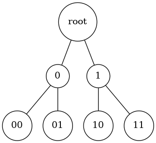

# OSI 七层模型介绍

- 物理层，电平/电磁波频率/编码（调制解调），一定是广播，也没有地址概念，直接传输比特流

- 数据链路层，以太网，arp，用于分配总线上的控制权（介质访问控制，MAC），有MAC地址，单播/广播/组播其实都是广播，只不过看到和自己有关才处理数据，只能在局域网间通信。从比特流中切分出帧

- 网络层，IP协议，联通各个局域网，通过路由器作为中继，实现真正的远距离通信。由于数据链路层总是独占介质，省内通信不必占用国际通道，把网络划分开后可以提升拓扑关系较近的通信效率，同时也节约了拓扑关系远的通信资源。使用IP地址+子网掩码，把所有的网络的拓扑关系用二叉树表示，可以实现分布式递归查找去往目标节点的路径。

  

  如上图所示，地址为0.0的节点想与1.0通信，通过地值计算就知道自己的子网里没它，只好发到上级0号地址，0号地址发现自己的子网也没它，继续发往自己的父节点，直到root节点看到自己的子网里有1.0,发给1号节点，1号节点发给1.0号节点，便形成了树内寻路算法。

- 传输层，TCP/UDP/Socket，联通各个应用，使用端口号。每个程序都想使用网络通信，用端口号区分不同程序，免得不相关的程序监听重要信息，并且正经程序也没必要监听别的程序的流量。另一方面数据跨过很远才传送过来，信息/顺序都乱套了，还常常会丢数据，也要保障可靠。

- 会话层/表示层/应用层，很多时候没有也不必区分清晰的界限，都是软件控制的，往往不再涉及到最关键的基础设施（比如路由器必须支持IP协议）。只要使用本层协议的两端互相商量好即可，所以这个层面的协议理论上切分为多少层就看软件工程的设计了。对于程序员来说最熟悉的也是这一层，从会话层的socks协议代理上网，到TLS多一层加密，再到HTTP约定信息传输的方式，可以有五花八门的变化。

