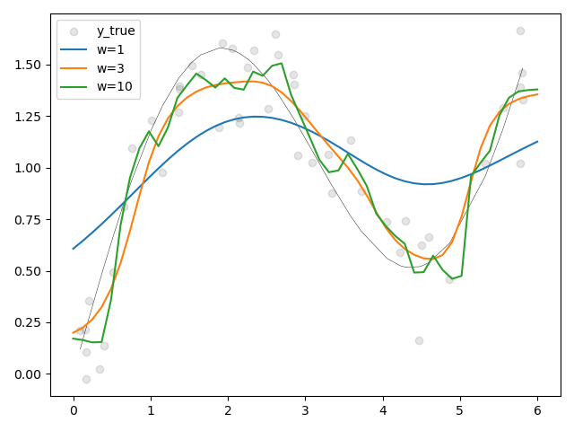

# [Attention Pooling: Nadaraya-Watson Kernel Regression](http://zh.d2l.ai/chapter_attention-mechanisms/nadaraya-waston.html)

## NW Kernel Regression

现有样本$(x_1, y_1), (x_2, y_2), ...$，对于变量$x$，想估计$y$，如果直接通过数据推导$y$的值，其实就可以用变量与样本接近程度$x-x_i$产生一个权重，对$y_i$加权。

这么说比较抽象，核心思想是如果假设样本是从光滑曲线上采样得到，那么就可以认为$x-x_i$越接近0则$y_i$的参考意义越大。时用一个核函数$K(x-x_i)$生成权重，则可建立这个通用模型：
$$
f(x)=\sum\limits_i\frac{K(x-x_i)}{\sum\limits_jK(x-x_j)}y_i
$$
当然，其实不乘以$y_i$得到的就是权重，显然对于所有$x_i$算出的权重加和等于1。

正常的NW核回归计算权重时一般不用全部$x_i$，而是用滑动窗口，毕竟全都计算成本太高。为了描述起来简单，这里不考虑滑动窗口。

我们启发式地认为$x-x_i$越接近于0越好，正态分布的钟形曲线刚好符合随机变量越接近0值越大的特点，使用该钟形曲线生成权重估计$y$是很符合直觉的（但我认为NM核回归直接做加权对于很多分布来说都是有偏的，比如对于正弦曲线这样的波动函数来讲会导致估计的值偏向0，毕竟均值会减小方差）。因此核函数使用：
$$
K(u)=\frac{1}{\sqrt{2\pi}}e^{-\frac{u^2}{2}}
$$
代入到最上面的公式(1)后，约掉常数项可以得到
$$
f(x)=\sum\limits_isoftmax\left(-\frac{1}{2}(x-x_i)^2\right)y_i
$$
本质上就是使用偏差平方相反数的softmax作为权重，偏差越小权重越大。

我们可以加一个缩放系数$w$，乘在$x-x_i$上，得到：
$$
f(x)=\sum\limits_isoftmax\left(-\frac{1}{2}\left((x-x_i)w\right)^2\right)y_i
$$


这本质上相当于高斯核的$u$变成$uw$，可以看出$w$越大，钟形曲线越陡峭，约注重局部信息；相反$w$越小则越看重全局信息。


## NW Kernel Regression to Attention

用query($x$)，从keys($x_i$)查询value($y_i$)，就可以得到attention并估计$y$了。

```python
import pylab


def softmax(arr):
    exp = pylab.exp(arr)
    return exp / exp.sum()


x_i = pylab.sort(pylab.rand(50) * 6)
y_true = pylab.sin(x_i) + x_i / 3  # y=sin(x)+x/3
y_i = y_true + (pylab.rand(*y_true.shape) - pylab.rand(*y_true.shape)) * 0.5


def predict(x, w=1):
    attention = softmax(-1 / 2 * ((x - x_i) * w) ** 2)
    y = sum(attention * y_i)
    return y


x_test = pylab.linspace(0, 6, 50)
pylab.scatter(x_i, y_i, color='black', alpha=0.1, label='y_true')
pylab.plot(x_i, y_true, 'k-', lw=.3)
for w in (1, 3, 10):
    y_pred = [predict(x, w=w) for x in x_test]
    pylab.plot(x_test, y_pred, label=f"{w=}")

pylab.legend()
pylab.tight_layout()
pylab.show()

```

