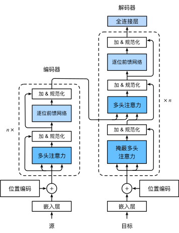

[d2l.ai-transformer](http://zh.d2l.ai/chapter_attention-mechanisms/transformer.html)

变压器的结构本身比较简单，分为如下结构：

- input encoding
  - embedding
  - positional encoding
- encoder blocks
  - residual -> multihead attention -> layer normalization
  - residual -> feed forward -> layer normalization
- decoder blocks
  - residual -> masked multihead attention -> layer normalization
  - residual -> multihead attention -> layer normalization
  - residual -> feed forward -> layer normalization
- output:
  - feed forward

所以核心部件如下：

- embedding
- positional encoding
- residual mechanism
- (masked) multihead attention
- layer normalization
- feed forward net

