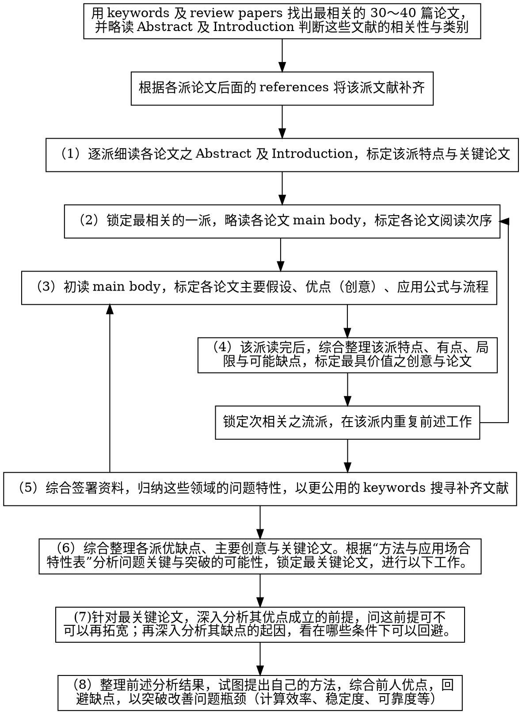

# 论文结构

- Abstract：主要贡献、方法特色、主要内容。要只看Abstract和Introduction就能分析出该论文重点是否与研究相关，而决定是否将它读完。
- Introduction：介绍背景起源，交代前人贡献，讲明白未解决的问题，和在该背景下这篇论文想解决的问题和它的重要性。

# 阅读方法

## 1. 掌握该领域主要方法、文献之间的关系

**注意：该步骤基本只需要读Abstract和Introduction**

对题目不熟时，先收集30～40篇，每篇只读Abstract和Introduction，不要读Main Body，只在最后参考Illustrative examples和Conclusions，直到能回答出（2A）最常被引述的
方法与（2B）可以分成的主要派别（2C）每个派别的主要特色（含优
点和缺点）。

[找论文的方法：寻找“review paper”]

为了能回答（2A）（2B），先阅读Introduction比较有观念的论文。

如果无法回答（2C），则先根据（2A）的答案找齐该领域最常被引述的论文，再根据（2B）分派别，按时间顺序排好。之后每次只需重读一派的Abstract和与这派有关的Introduction，便能总结出这一派的**主要诉求、方法特色和优点**。

之后，再使用这些论文阅读Introduction，回答**“每篇论文对其他派别有什么批评”**。

至此，应当掌握了该领域主要论文，并能勇者写论文测试搜索关键词的恰当程度，并用修正后的关键词重新生成论文库。如果有充足的理由和把握，可以只保留2、3个派别。

利用（2C）中的答案，进一步回答（2D）：这个领域大家关注的1. 关键问题，2. 优缺点，3. 优缺点的重视**场合**，4. 优缺点的不重视**场合**。整理出该领域不同派别应用场合以及注意事项。

根据（2A）和（2C），按派别分类，派别内按时间排序，按派别与研究方向关系由近及远的顺序，按派别依次读完每派的main bodies。

## 2. 

# 附录

## 带着哪些问题阅读论文

- （2A）在这领域内最常被引述的
  方法有哪些？
- （2B）这些方法可以分成哪些主要派别？
- （2C）每个派别的主要特色（含优
  点和缺点）是什么？
- （2D）：「这个领域内大家认为
  重要的关键问题有哪些？有哪些特性是大家重视的优点？有哪些特性是大家在意的缺点？
  这些优点与缺点通常在哪些应用场合时会比较被重视？在哪些应用场合时比较不会被重
  视？」
- （3A）这篇论文
  的主要假设是什么（在什么条件下它是有效的），并且评估一下这些假设在现实条件下有多
  容易（或多难）成立。愈难成立的假设，愈不好用，参考价值也愈低。
- （3B）在这些假设下，
  这篇论文主要有什么好处。
- （3C）这些好处主要表现在哪些公式的哪些项目的简化上。
- （3D）这一派主要的缺点有哪些。

## 方法与应用场合特性表

## 论文阅读流程图

