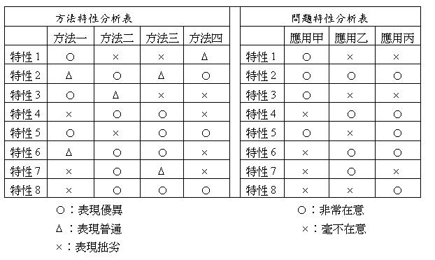
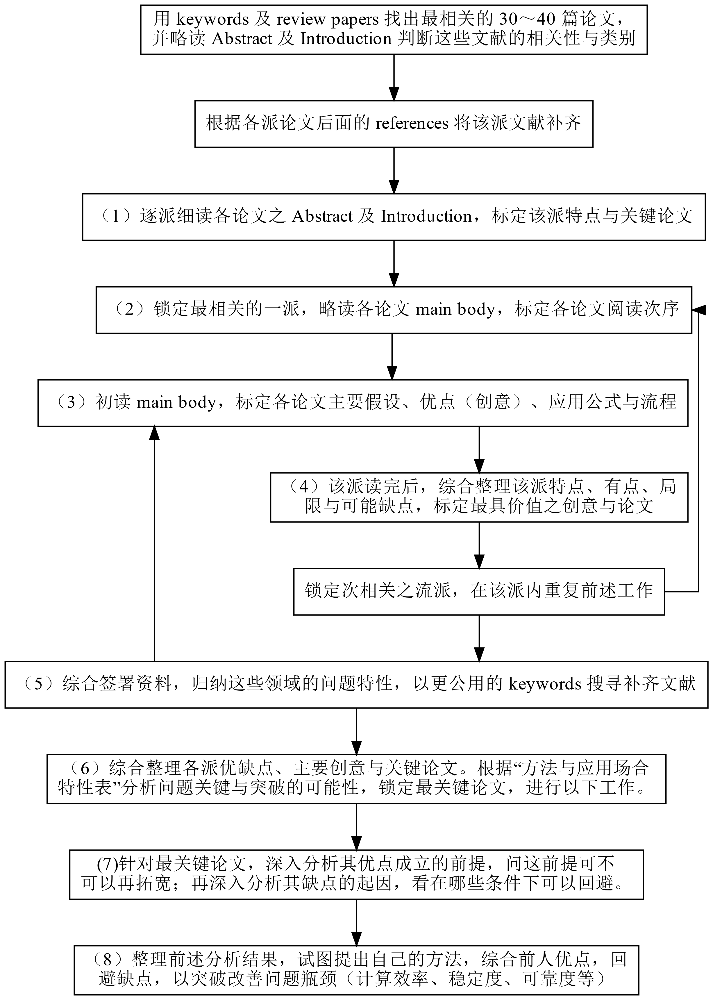

# 论文结构

- Abstract：主要贡献、方法特色、主要内容。要只看Abstract和Introduction就能分析出该论文重点是否与研究相关，而决定是否将它读完。
- Introduction：介绍背景起源，交代前人贡献，讲明白未解决的问题，和在该背景下这篇论文想解决的问题和它的重要性。
- Main body: 包含 simulation and/or experimental examples。

# 阅读方法

看论文只需把会用到的完全搞懂，其他之要了解 idea，不该仔细看推导过程。

硕士生必须学会选择性
的阅读，而且必须锻炼出他选择时的准确度以及选择的速度，不要浪费时间在学用不着的
细节知识！多吸收「点子」比较重要，而不是细部的知识。

## 1. 掌握该领域主要方法、文献之间的关系

**注意：该步骤基本只需要读 Abstract 和 Introduction**

对题目不熟时，先收集30～40篇，每篇只读 Abstract 和 Introduction ，不要读Main Body，只在最后参考 Illustrative examples 和 Conclusions，直到能回答出（2A）最常被引述的
方法与（2B）可以分成的主要派别（2C）每个派别的主要特色（含优
点和缺点）。

[找论文的方法：寻找“review paper”]

为了能回答（2A）（2B），先阅读Introduction比较有观念的论文。

如果无法回答（2C），则先根据（2A）的答案找齐该领域最常被引述的论文，再根据（2B）分派别，按时间顺序排好。之后每次只需重读一派的Abstract和与这派有关的Introduction，便能总结出这一派的**主要诉求、方法特色和优点**。

之后，再使用这些论文阅读Introduction，回答**“每篇论文对其他派别有什么批评”**。

至此，应当掌握了该领域主要论文，并能勇者写论文测试搜索关键词的恰当程度，并用修正后的关键词重新生成论文库。如果有充足的理由和把握，可以只保留2、3个派别。

利用（2C）中的答案，进一步回答（2D）：这个领域大家关注的1. 关键问题，2. 优缺点，3. 优缺点的重视**场合**，4. 优缺点的不重视**场合**。整理出该领域不同派别应用场合以及注意事项。

根据（2A）和（2C），按派别分类，派别内按时间排序，按派别与研究方向关系由近及远的顺序，按派别依次读完每派的 main bodies。

## 2. 整理每一派最适合什么时候使用，最不适合什么场合使用

只需要读懂：（3A）该论文主要假设，现实条件下假设多难成立，以评估参考价值。（3B）在这些假设下，此论文的好处（3C）好处表现在哪些公式的哪些项目简化上。

公式只看最后用到的公式以便评估方便程度/计算效率，以及非理想情况下的可靠度；**推导中只看加入的假设条件，而不看恒等变换。**

阅读时，只需粗略浏览，挑出易懂论文后按时间顺序阅读，只需回答（3A）、（3B）、（3C）。

回答完三个问题后，整理出这一派主要发展过程、假设、理论依据、成果。根据（2D）与这一派主要假设，回答**（3D）这一派主要缺点**。根据（3A）、（3B）、（3C）、（3D）整理出：这一派最适合什么时候使用，最不适合什么场合使用。

## 3. 补充说明

一整批一起读懂到某个层次，而不是逐篇读懂。大部分论文只了解观念，不看推导。

读不懂的地方大胆猜测，然后从论文里找根据。

# 论文报告要求及技巧

1. 投影片第一页必须列出论文的题目、作者、论文出处与年份。

2. 以下每一页投影片只能讲一个观念，不可以在一张投影片里讲两个观念。

3.  说明这篇论文所研究的问题的重点，以及这个问题可能和工业界的哪些应用相关。

4. 清楚交代这篇论文的主要假设，主要公式，与主要应用方式（以及应用上可能的解题流程）。

5. 说明这篇论文的范例（simulation examples and/or experiments），预测这个方法在不同场合时可能会有的准确度或好用的程度

6. 你个人的分析、评价与批评，包括：

   （6A）这篇论文最主要的创意是什么？

   （6B）这些创意在应用上有什么好处？

   （6C）这些创意和应用上的好处是在哪些条件下才能成立？

   （6D）这篇论文最主要的缺点或局限是什么？

   （6E）这些缺点或局限在应用上有什么坏处？

   （6F）这些缺点和应用上的坏处是因为哪些因素而引入的？

   （6G）你建议学长学弟什么时候参考这篇论文的哪些部分（点子）？

# 附录

## 带着哪些问题阅读论文

- **（2A）**在这领域内最常被引述的方法有哪些？
- **（2B）**这些方法可以分成哪些主要派别？
- **（2C）**每个派别的主要特色（含优点和缺点）是什么？
- **（2D）**：「这个领域内大家认为重要的关键问题有哪些？有哪些特性是大家重视的优点？有哪些特性是大家在意的缺点？这些优点与缺点通常在哪些应用场合时会比较被重视？在哪些应用场合时比较不会被重视？」
- **（3A）**这篇论文的主要假设是什么（在什么条件下它是有效的），并且评估一下这些假设在现实条件下有多容易（或多难）成立。愈难成立的假设，愈不好用，参考价值也愈低。
- **（3B）**在这些假设下，这篇论文主要有什么好处。
- **（3C）**这些好处主要表现在哪些公式的哪些项目的简化上。
- **（3D）**这一派主要的缺点有哪些。

## 方法与应用场合特性表

## 论文阅读流程图

